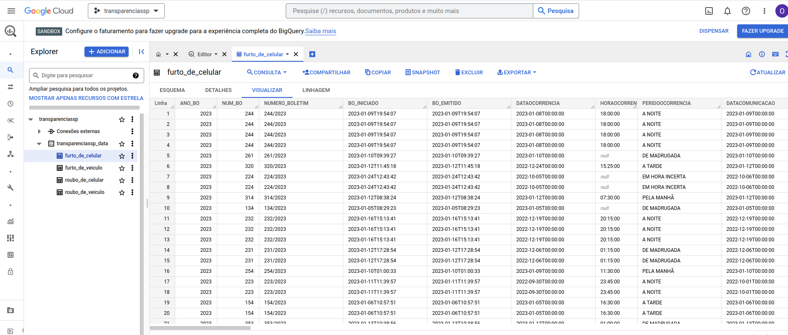

# Secretaria de Segurança Pública - Transparência
Este projeto visa extrair dados a princípio de crimes de Roubo e Furtos
de Veículos e Celulares. Para gerar um mapa de calor que possa informar
ao cidadão paulista ou paulistano os lugares onde ele corre mais risco.

Os dados foram extraídos do [Portal da Transparência](http://www.ssp.sp.gov.br/transparenciassp/)

Depois de baixados, os dados são tratados e inseridos no [BigQuery](https://cloud.google.com/bigquery) 

*NOTA: Este é um projeto pessoal que usa dados públicos.*

> Na minha máquina roda um Ubuntu 22.04 LTS. Então as instruções abaixo foram testadas neste ambiente.

## Instalando python, pip e git

```
sudo apt update
sudo apt install python3
sudo apt install python3-pip
sudo apt install git
```

## Instalando o Ambiente Virtual para rodar o projeto

```
 sudo apt update 
 sudo apt install python3-venv
 python3 -m venv seguranca_sp_venv
 source seguranca_sp_venv/bin/activate
```

## Instalando o Playwright

> Para saber mais sobre o [Playwright](https://playwright.dev/)

```
 pip install pytest-playwright 
 playwright install
```
## Clonando o repositório

````
git clone https://github.com/oraculodata/crimes_sp.git 
cd crimes_sp
````

## Instalando as dependências 

```
pip install -r requirements.txt
```


## Execute os scripts de captura e carga de dados

> Catch Crimes
```
python catch_crimes.py
```

> Load Crimes

```
python load_bq.py
```

Após as cargas:



## Próximos passos

Vou criar umas dashboards para alertar o cidadão paulista e paulistano em tempo real o risco que está correndo em determinados locais, usando sua geolocalização.

> Só não poderá usar o celular para consultar em locais de risco. Entre numa loja ou qualquer lugar que você considera seguro.